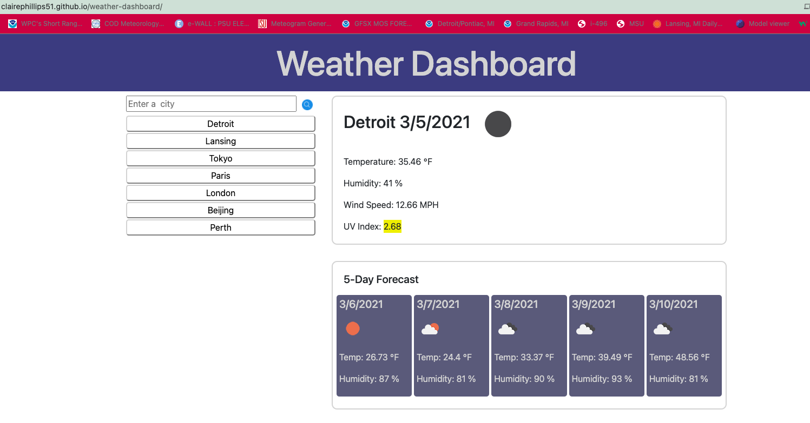
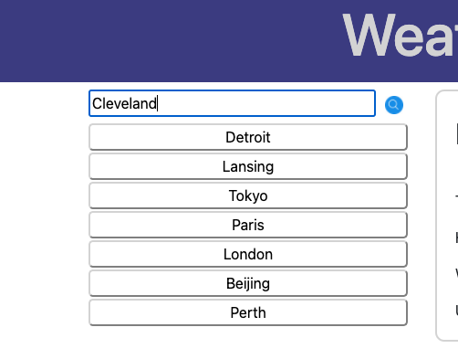
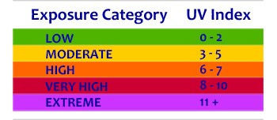

# Weather Dashboard
Link: [Weather Dashboard](https://clairephillips51.github.io/weather-dashboard/)

## Summary
Making a weather dashboard that displays current weather conditions and a five-day forecast for a given city. Any typed in city is saved to a list that when clikced that citis weather can be viewed.

## Table of Contents
1. [Process](#process)
2. [Usage](#usage)
3. [What I Learned](#what-i-learned)
4. [Resources](#resources)

## Process
Using fetch to get data from [Openweathermap.org](https://openweathermap.org/api) API to create a weather dahsboard for a given city that the user types in. Three api's were used which are listed under [Resources](#resources). Once the data was retrived certain current weather condtions, and a five day forecast would be displayed. The city name would also be saved to a list under the search bar. 

I stated with the html file to set up the placement of certain objects on the page. I used bootsrap to help with a basic grid system that had two columns, each column contains two `
`s from there each `
`ccontains one of the main pieces of the webpage: the search bar, city list, current weather data, and 5 day forecast.  I then wrote the javascript file to get the data using fetch and display the desired data on the webpage using the then promise.  Css was the final piece used to make the dashboard look nice. 

## Usage
The website opens to a fairly bare page with a search bar that says "Enter a city". The user will type in what ever city they want to see weather information for. It will show the first city of that name it can find so specifying a certain state or country may be necessary.

Using local storage the city name will saved to a list under the search bar. Each city name is turned into a button so clikcing on the city will bring up the weather data for that location. 

Once a city is picked or typed in the weather data will show up on to the right of the search bar. There are two sections the first is current weather which shows: the date, a weather icon showing the current conditions, the temperature, the humidity, the wind speed, and the UV index. Under current weather is a five day forecast that displays: the date, a weather icon showing the days condition, the temperature, and the humidity.

The uv index is also color coded to show if the uv index is low. moderate, high, very high, or extreme.

Refreshing the page will clear the weather data, but the list of city names will remain. 

## What I Learned
Using multiple api was tricky, especially fiding data for the UV index. I had to make what felt like nested fetch calls so that the uv index data would show up with the other current conditions. I only used one html file for my sake to make it easier for myself rather than using location replace with a seperate html file for the weahter data elements. 

## Resources
* [Local Storage](https://www.w3schools.com/jsref/prop_win_localstorage.asp)
* [Moment.js Docs](https://momentjs.com/docs/#/displaying/) 
* [Openweathermap One Call API](https://openweathermap.org/api/one-call-api)
* [OpenWeathermap Current Weather Data ](https://openweathermap.org/current)
* [OpenWeathermap 5 Day Weather Forecast ](https://openweathermap.org/forecast5#format) 
